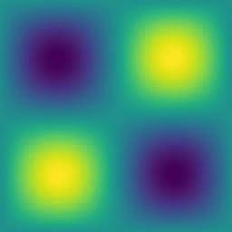
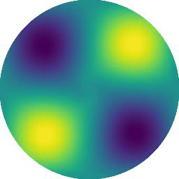

```
## Environment
The environment can be installed by conda via:
```bash
conda env create -f environment.yml
conda activate vortex_env
```

Our code is tested on `Windows 10` and `Ubuntu 20.04`.

## Lamb-Oseen vortex Re=10

#### Pretrain

First, execute the command below to pretrain the trajectory network so that the initial vortices are regularly spaced to cover the simulation domain and remains stationary.

```bash
python train.py --config configs/lamb_oseen_vortex_Re=10.txt --run_pretrain True
```

Once completed, navigate to `pretrained/exp_lamb_oseen_vortex_Re=10/tests/` and check that the plotted dots are regularly spaced and remain roughly stationary. A file `pretrained.tar` shall also appear at `pretrained/exp_lamb_oseen_vortex_Re=10/ckpts/`.

#### Train

Then, run the command below to train.

```bash
python train.py --config configs/lamb_oseen_vortex_Re=10.txt
```

Checkpoints and testing results are written to `logs/exp_lamb_oseen_vortex_Re=10/tests/` once every 1000 training iterations.

#### Results



Note that since our PyTorch code includes nondeterministic components (e.g., the CUDA grid sampler), it is expected that each training session will not generate the exact same outcome.

## Lamb-Oseen vortex Re=100

#### Pretrain

```bash
python train.py --config configs/lamb_oseen_vortex_Re=100.txt --run_pretrain True
```

#### Train

```bash
python train.py --config configs/lamb_oseen_vortex_Re=100.txt
```

#### Results


## Lamb-Oseen vortex Re=1000

#### Pretrain

```bash
python train.py --config configs/lamb_oseen_vortex_Re=1000.txt --run_pretrain True
```

#### Train

```bash
python train.py --config configs/lamb_oseen_vortex_Re=1000.txt
```

#### Results


## Lamb-Oseen vortex Re=1000 Omega=1

#### Pretrain

```bash
python train.py --config configs/lamb_oseen_vortex_Re=1000_omega=1 --run_pretrain True
```

#### Train

```bash
python train.py --config configs/lamb_oseen_vortex_Re=1000_omega=1 .txt
```

#### Results



## Multi-vortices Re=1000

#### Pretrain

```bash
python train.py --config configs/multi_vortices_Re=1000_1_2.txt --run_pretrain True
```

#### Train

```bash
python train.py --config configs/multi_vortices_Re=1000_1_2.txt
```

#### Results


## Trying your own video
We assume the input is a Numpy array of shape `[num_frames], 256, 256, 3`, with the last dimension representing RGB pixel values between 0.0 and 1.0, located in `data/[your_name_here]/imgs.npy`. For fluid videos with boundaries (like in our real-world examples), it is required that a Numpy array of shape `256, 256` representing the signed distance field to the boundary be supplied in `data/[your_name_here]/sdf.npy`. We assume the signed distance has a unit of pixels.
